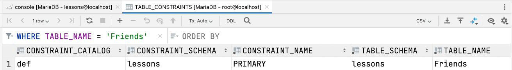
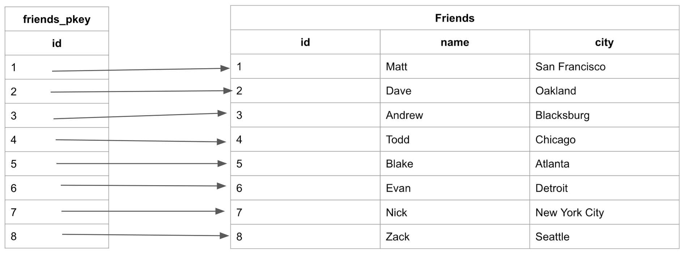

# Clustered index

Clustered indexes are the unique index per table that uses the primary key to organize the data that is within the table. The clustered index ensures that the primary key is stored in increasing order, which is also the order the table holds in memory.

* Clustered indexes do not have to be explicitly declared.
* Created when the table is created.
* Use the primary key sorted in ascending order.
* Clustered indexes sort and store the data rows in the table or view based on their key values. These are the columns included in the index definition. There can be only one clustered index per table, because the data rows themselves can be stored in only one order.  
* The only time the data rows in a table are stored in sorted order is when the table contains a clustered index. When a table has a clustered index, the table is called a clustered table. If a table has no clustered index, its data rows are stored in an unordered structure called a heap.

The clustered index will be automatically created when the primary key is defined:

```sql
DROP TABLE IF EXISTS `Friends`;

CREATE TABLE `Friends`
(
    `Id` INT NOT NULL AUTO_INCREMENT PRIMARY KEY,
    `Name` NVARCHAR(50) NOT NULL,
    `City` NVARCHAR(50) NOT NULL
);
```

The created table, "friends", will have a clustered index automatically created, organized around the Primary Key "id" called "PRIMARY(Id)...":



---



When searching the table by “id”, the ascending order of the column allows for optimal searches to be performed. Since the numbers are ordered, the search can navigate the B-tree allowing searches to happen in logarithmic time.