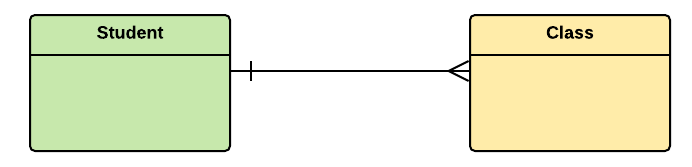
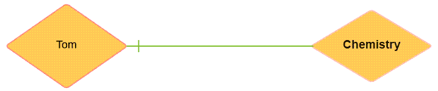
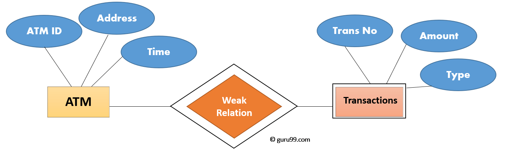
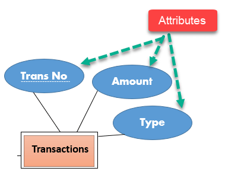

# Components of diagram

This model is based on three basic concepts:

- Entities
- Attributes
- Relationships

## WHAT IS ENTITY?

A real-world thing either living or non-living that is easily recognizable and nonrecognizable. It is anything in the enterprise that is to be represented in our database. It may be a physical thing or simply a fact about the enterprise or an event that happens in the real world.

An entity can be place, person, object, event or a concept, which stores data in the database. The characteristics of entities are must have an attribute, and a unique key. Every entity is made up of some ‘attributes’ which represent that entity.

**Examples of entities:**

- **Person:** Employee, Student, Patient
- **Place:** Store, Building
- **Object:** Machine, product, and Car
- **Event:** Sale, Registration, Renewal
- **Concept:** Account, Course

## Relationship

Relationship is nothing but an association among two or more entities. E.g., Tom works in the Chemistry department. Entities take part in relationships. We can often identify relationships with verbs or verb phrases.

## Weak Entities

A weak entity is a type of entity which doesn’t have its key attribute. It can be identified uniquely by considering the primary key of another entity; therefore, it must use a foreign key in conjunction with its attributes to create a primary key.

## Attributes

It is a single-valued property of either an entity-type or a relationship-type.

For example, a lecture might have attributes: time, date, duration, place, etc.

An attribute in ER Diagram examples, is represented by an Ellipse

