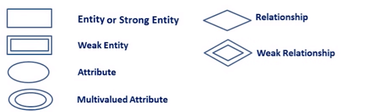

# ERD Symbols & Notations

**Following are the main components and its symbols in ER Diagrams:**

- **Rectangles:** This Entity Relationship Diagram symbol represents entity types
- **Ellipses :** Symbol represent attributes
- **Diamonds:** This symbol represents relationship types
- **Lines:** It links attributes to entity types and entity types with other relationship types
- **Primary key:** attributes are underlined
- **Double Ellipses:** Represent multi-valued attributes

