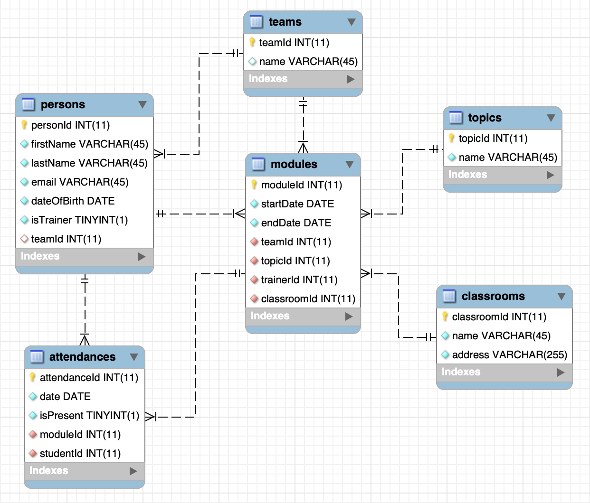

# Example

Design a database which will store all the relevant information needed for scheduling classes activity. Think about the trainers, students, teams, classrooms, modules and attendance list. There are multiple students in a team. A trainer can teach one or multiple modules. A team can have classes in one or multiple classrooms. For the attendance, we usually say that a student was or wasn't present on a particular day. What’s the difference between trainers and students? Do we need multiple tables to store their information or would one suffice? If a team consists of multiple students but a student can only belong to one team what kind of relationship would we use? If a module represents a trainer teaching a specific topic, for a specific team, in a specific location, between certain dates, how would you model this?

