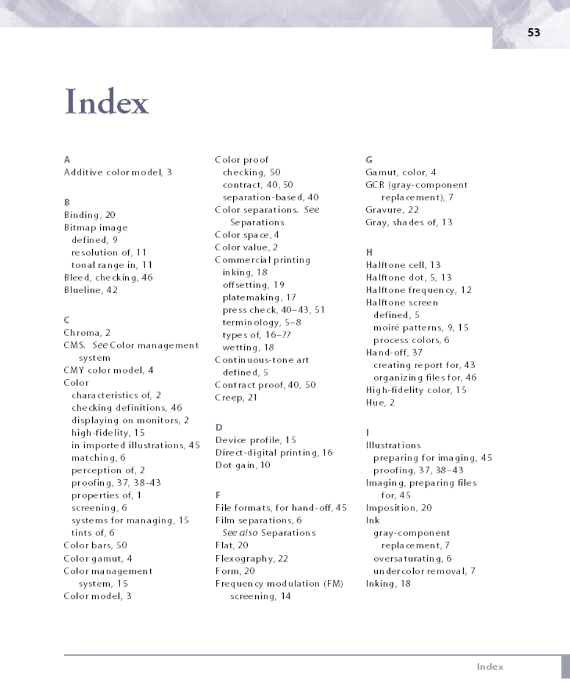

# Non-clustered index

Non-clustered indexes are sorted references for a specific field, from the main table, that hold pointers back to the original entries of the table.


They are used to increase the speed of queries on the table by creating columns that are more easily searchable.

You can think of these just like indexes in a book. The index points to the location in the book where you can find the data you are looking for.




* Non-clustered indexes have a structure separate from the data rows. Non-clustered indexes point to memory addresses instead of storing data themselves.
* You can add nonkey columns to the leaf level of the nonclustered index to by-pass existing index key limits, and execute fully covered, indexed, queries. For more information, see Create indexes with included columns. For details about index key limits see Maximum capacity specifications for your DMS.
* A non-clustered index is an index structure separate from the data stored in a table that reorders one or more selected columns.
* A non-clustered index slower to query than clustered indexes but typically much faster than a non-indexed column.

Nonclustered indexes are implemented in the following ways:

* UNIQUE constraints
* Index independent of a constraint
* Nonclustered index on an indexed view


```sql
CREATE INDEX index1 ON Friends(Name);

CREATE UNIQUE INDEX index1 ON Friends(Name DESC, City ASC);
```

```sql
DROP INDEX index1 ON Friends;
```