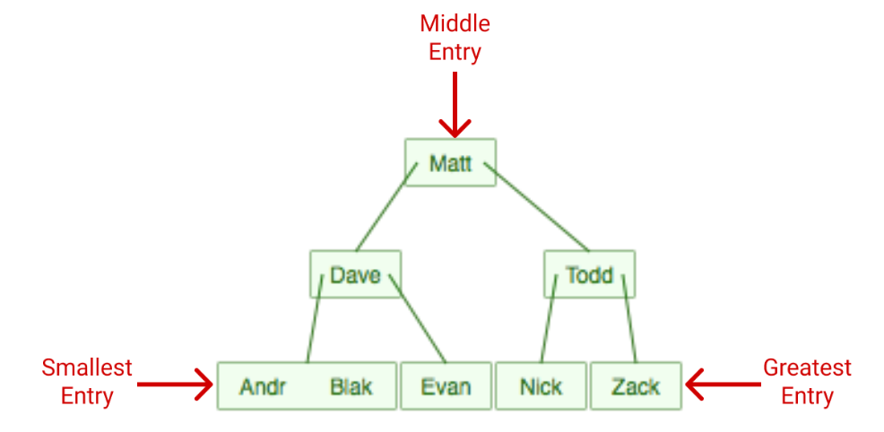

# Types of indexing?

There are two types of databases indexes:
* Clustered
* Non-clustered

Both clustered and non-clustered indexes are stored and searched as B-trees, a data structure similar to a binary tree.

In computer science, a B-tree is a self-balancing tree data structure that maintains sorted data and allows searches, sequential access, insertions, and deletions in logarithmic time [https://en.wikipedia.org/wiki/B-tree](https://en.wikipedia.org/wiki/B-tree).

In simple words B-tree creates a tree-like structure that sorts data for quick searching.

