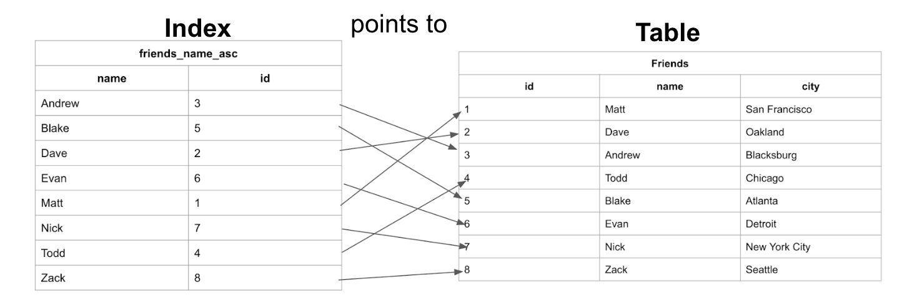

# What exactly is and index?

* An index is a structure that holds the field the index is sorting and a pointer from each record to their corresponding record in the original table where the data is actually stored.

We can see here that the table has the data stored ordered by an incrementing id based on the order in which the data was added. And the Index has the names stored in alphabetical order.