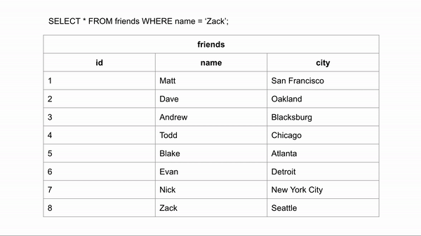

# What is indexing?

Indexing makes columns faster to query by creating pointers to where data is stored within a database.

Visualization for finding the last entry without indexing:

In this case we need to go through all table rows to find a result.

If the table was ordered alphabetically, searching for a name could happen a lot faster because we could skip looking for the data in certain rows. If we wanted to search for "Zack" and we know the data is in alphabetical order we could jump down to halfway through the data to see if Zack comes before or after that row. We could then half the remaining rows and make the same comparison.

* Indexes allow us to create sorted lists without having to create all new sorted tables, which would take up a lot of storage space.